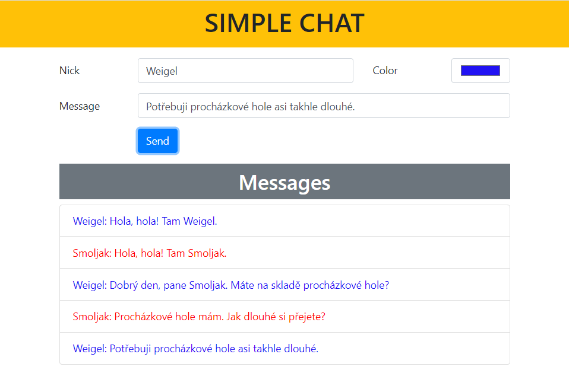

# Simple chat - ukázková aplikace využívající web socketů

  

## Použité technologie

- Node.js
- Express
- Socket.io
- Docker

## Instalace a spuštění aplikace

> `git clone https://github.com/lucny/socket-chat.git`  
> `cd socket-chat`  
> `npm install`  
> `node server.js` 

## Použití Dockeru

Vytvoření obrazu s argumentem VERSION:
`docker build -t socketio_chat --build-arg VERSION=16 .`

Spuštění kontejneru:
`docker run -d --name socketchat -p 5000:5000 socketio_chat`